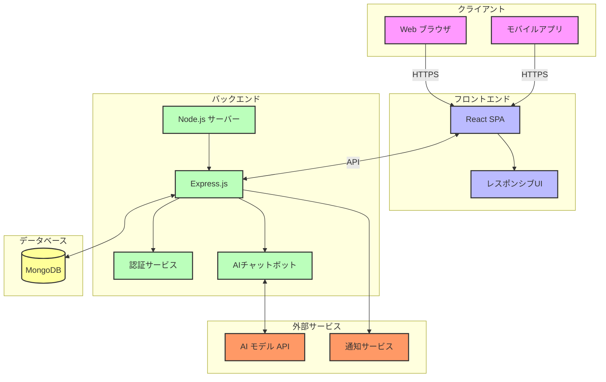

```mermaid
    graph TB
        subgraph "クライアント"
        A[Web ブラウザ]
        B[モバイルアプリ]
        end

            subgraph "フロントエンド"
                C[React SPA]
                D[レスポンシブUI]
            end

            subgraph "バックエンド"
                E[Node.js サーバー]
                F[Express.js]
                G[認証サービス]
                H[AIチャットボット]
            end

            subgraph "データベース"
                I[(MongoDB)]
            end

            subgraph "外部サービス"
                J[AI モデル API]
                K[通知サービス]
            end

            A -->|HTTPS| C
            B -->|HTTPS| C
            C --> D
            C <-->|API| F
            E --> F
            F --> G
            F --> H
            F <--> I
            H <--> J
            F --> K

            style A fill:#f9f,stroke:#333,stroke-width:2px
            style B fill:#f9f,stroke:#333,stroke-width:2px
            style C fill:#bbf,stroke:#333,stroke-width:2px
            style D fill:#bbf,stroke:#333,stroke-width:2px
            style E fill:#bfb,stroke:#333,stroke-width:2px
            style F fill:#bfb,stroke:#333,stroke-width:2px
            style G fill:#bfb,stroke:#333,stroke-width:2px
            style H fill:#bfb,stroke:#333,stroke-width:2px
            style I fill:#ff9,stroke:#333,stroke-width:2px
            style J fill:#f96,stroke:#333,stroke-width:2px
            style K fill:#f96,stroke:#333,stroke-width:2px

```
